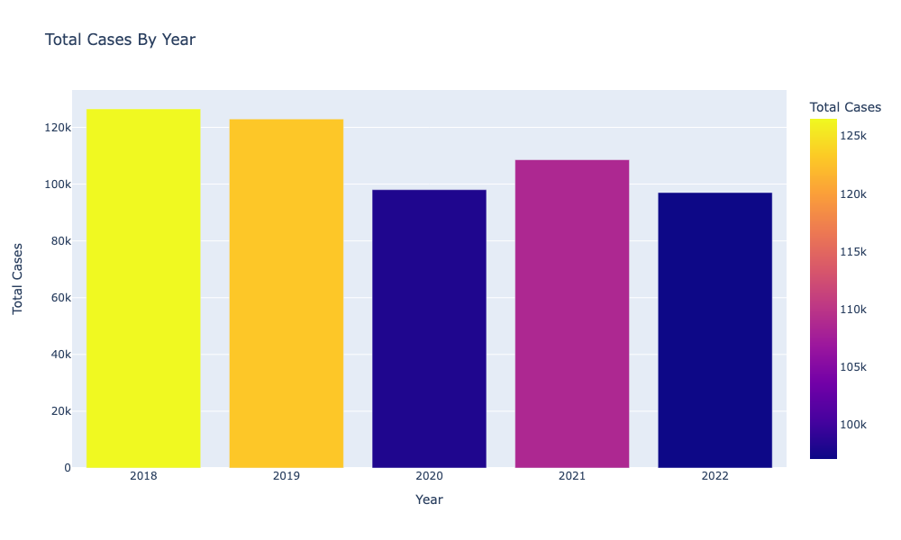
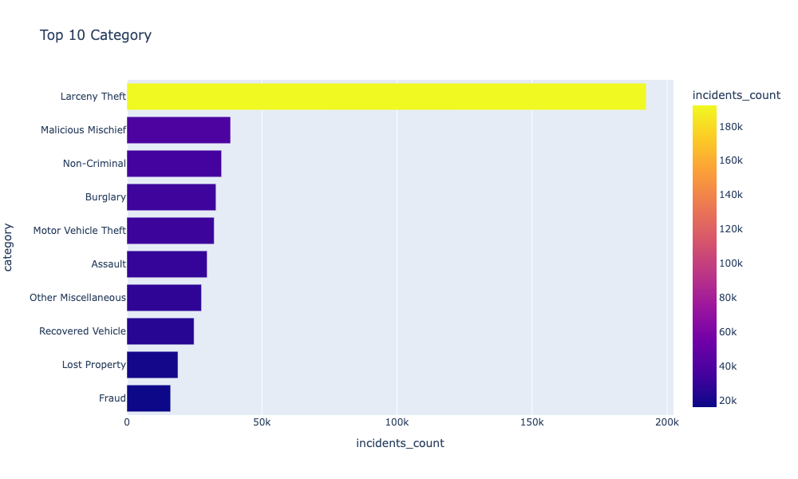
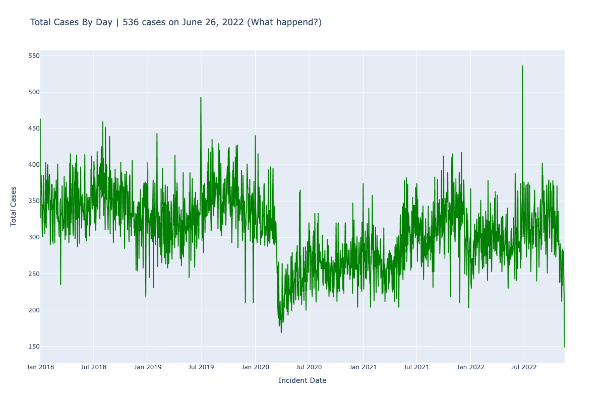

# San Francisco Police Incidents Report 2018-2022
## Overview
- About **600,000 rows of San Francisco Police Incident Report from 2018-2022** 
- Dataset: **DataSF**
- Count total incidents group by Neighborhoods
- Visualize using **GeoJson** data with **Folium** and **OpenStreetMap**
- **Deploy Dash Interactive web app on render and netlify**

[https://sanfrancisco-incidents-2018-2022.netlify.app/](https://sanfrancisco-incidents-2018-2022.netlify.app/)

[https://sf-crime-cases.onrender.com/](https://sf-crime-cases.onrender.com/)

## Total Cases Per Year

## Top 10 Categories

## Total Cases Per Day

