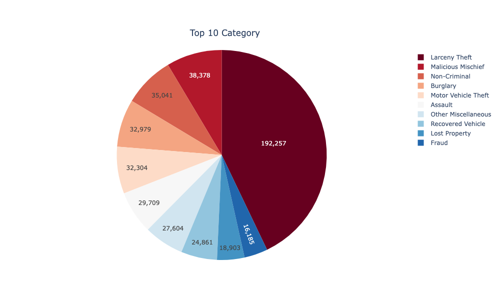

# San Francisco Incidents Report 2018-2022
## Overview
- About **600,000 rows of San Francisco Police Incident Report from 2018-2022** 
- Dataset: **DataSF**
- Count total incidents group by Neighborhoods
- Visualize using **GeoJson** data with **Folium** and **OpenStreetMap**
- **Deploy web app on Netlify**
#### [https://sanfrancisco-incidents-2018-2022.netlify.app/](https://sanfrancisco-incidents-2018-2022.netlify.app/)

https://user-images.githubusercontent.com/93210361/202836050-3ebe4d66-0952-4ad1-a8bf-d638fccaa0b8.mov

## Total Cases By Year

## Top 10 Categories

## Total Cases Per Day

